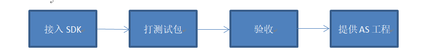
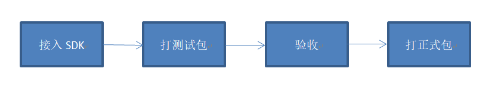

# 对接流程

## Android对接流程

#### **1. 接入sdk**

参考[《Android接入流程》](android-jie-ru/)接入SDK。  
参考[《业务接口》](ye-wu-jie-kou/)调用代码。常规必接的包括广告、退出、统计，计费和其他功能根据产品需求选择接入。

**2. 打测试包**

按照Demo中的包名和产品参数进行设置，即可测试广告、计费等功能。  
可通过Tag为ADLog的日志查看广告加载和显示情况。

**3. 验收**

将测试包提供给我们验收。我们会确认广告埋点和道具下发是否正常，必接项是否接入，游戏功能是否完整。

**4. 提供AS工程**

发送AndroidStudio打包工程给我们的技术跟进人。后续内容更新也需要同步给技术跟进人。

## iOS对接流程

**1. 接入sdk**

参考[《iOS接入流程》](ios-jie-ru.md)接入SDK。  
参考[《业务接口》](ye-wu-jie-kou/)调用代码。常规必接的包括广告、统计功能，计费和其他功能根据产品需求选择接入。

**2. 打测试包**

首次接入需要按照我们提供的包名、证书、项目ID进行配置，即可测试广告、计费等功能。  
测试的包名和证书可联系技术人员获取。

**3. 验收**

将ipa提供给我们验收。我们会确认广告埋点和道具下发是否正常，必接项是否接入，游戏功能是否完整。

**4. 打正式包**

分两种情况：

A.使用CP自己的账号提包**：**

1. 按照我们提供的正式产品参数进行打包
2. 发送ipa文件给我们确认参数
3. 自行打包上传

B.使用动能的账号提包：

1. 按照我们提供的正式产品参数、包名、证书进行打包后
2. 提供ipa文件给我们。



test Tab



test Tab2



