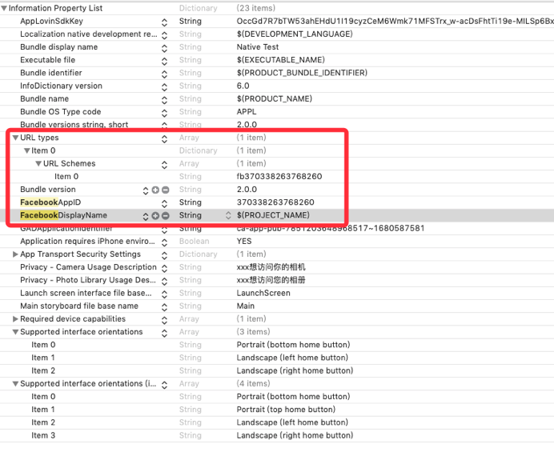
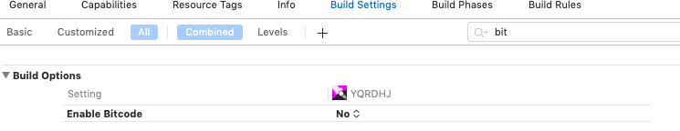
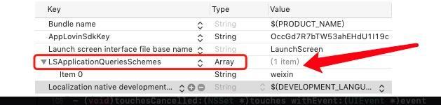

# iOS


## 1. 自动部署

自动部署可以省去您工程配置的时间。iOS SDK会通过CocoaPods进行发布，推荐您使用自动部署。 

1.  安装CocoaPods 

    CocoaPods是一个Swift和Objective-C项目的依赖管理器。它拥有超过49,000个第三方库，超过3,000,000个app都在使用cocoaPods做依赖管理，CocoaPods可以帮助你优雅的扩展你的项目。 如果您未安装过cocoaPods，可以通过以下命令行进行安装。更多详情请访问[CocoaPods官网](https://cocoapods.org/)。 

    ```
    $ sudo gem install cocoapods

    ```

    注意：安装过程可能会耗时比较长，也有可能收到网络状况导致失败，请多次尝试直到安装成功。 

2.  配置Podfile文件 

    在您的工程文件所在文件夹下有一个名为Podfile的文件。如果您第一次使用CocoaPods，可以在通过以下命令初始化一个Podfile文件： 

    ```
    $ pod init

    ```

    打开Podfile文件，应该是如下内容（具体内容可能会有一些出入）： 

    ```
    # platform :ios, '9.0'
    target 'podTest' do
      # use_frameworks!
      # Pods for podTest
    end

    ```

3、添加库地址

```
source 'http://wy@dnsdk.vimedia.cn:8080/r/IOSMavenSpec.git' #远程私有库地址
source 'https://github.com/CocoaPods/Specs.git' #公有库地址
```
4、根据需求单添加所需的组件
4.1 广告模块

单独导入具体广告
```
  pod 'IOSMaven/Ads/Headline'   #头条(需单独pod 'Bytedance-UnionAD', '~>2.8.0.1')
  pod 'IOSMaven/Ads/Google' #google
  pod 'IOSMaven/Ads/GDT' #广点通
  pod 'IOSMaven/Ads/Mintegral'  #Mintegral
  pod 'IOSMaven/Ads/Unity' #Unity
  pod 'IOSMaven/Ads/IronSource' #IronSource
  pod 'IOSMaven/Ads/Facebook'  #Facebook
  pod 'IOSMaven/Ads/Oneway'  #Oneway
  pod 'IOSMaven/Ads/Tapjoy'  #Tapjoy
  pod 'IOSMaven/Ads/Applovin'  #Applovin
  pod 'IOSMaven/Ads/API' #API
  pod 'IOSMaven/Ads/Vungle' #Vungle
 pod 'IOSMaven/Ads/IronSourceJH' #IronSourceJH 
```
```
#IronSourceJH 需要单独添加
 pod 'IronSourceAppLovinAdapter','4.3.10.1'
 pod 'IronSourceMintegralAdapter','4.3.1.0'
 pod 'IronSourceUnityAdsAdapter','4.3.0.1'
```
4.2 统计模块（*热云需要单独导入SDK）
```
  pod 'IOSMaven/TJ/Umeng'  #Umeng
  pod 'IOSMaven/TJ/HeadLine'  #HeadLine
  pod 'IOSMaven/TJ/Facebook' #Facebook
  pod 'IOSMaven/TJ/ReYun'  #ReYun
  pod 'IOSMaven/TJ/Appsflyer'  #Appsflyer
  pod 'IOSMaven/TJ/Adjust'  #Adjust
  pod 'IOSMaven/TJ/Tenjin'  #Tenjin
```
4.3 公告模块
```
pod 'IOSMaven/Notice' #Notice
```
4.4 支付模块

```
  pod 'IOSMaven/Pay' #Pay
```
4.5 Bugly模块

```
  pod 'IOSMaven/Bug' #Bug
```
4.6 Social模块

引入微信、facebook、apple
```
  pod 'IOSMaven/Social/weixin'
  pod 'IOSMaven/Social/facebook'
  pod 'IOSMaven/Social/appleSignIn'
```
4.7 Activity模块

```
  pod 'IOSMaven/Extension/Activity' #Activity
```
5、添加vigame模块
链接: https://pan.baidu.com/s/1r_XUoOEK3gbLd0ItTGwDtg 提取码: z7ya

### 

## 2. 添加所有的 .a 文件 路径和头文件链接

## (备注: 将deps文件删除引用。\)

\(target-&gt;build setting -&gt; search path -&gt;Header Search Paths 中添加\) 特殊添加一项目录 路径

`"$(SRCROOT)/Vigame/include"`

`"$(SRCROOT)/Vigame/tools"`

`"$(SRCROOT)/Vigame/deps/boost/include"`

`"$(SRCROOT)/Vigame/deps/curl/include"`

`"$(SRCROOT)/Vigame/deps/openssl/include"`

`"$(SRCROOT)/Vigame/deps/zlib/include"`


## 3. 添加必要配置

1. 打开 Capabilities-&gt; Keychain Sharing 获取设备唯一标识
2. 在info.plist添加Google广告配置

   GADIsAdManagerApp：YES

3. 如果项目中使用到Applovin广告在info.plist添加

   AppLovinSdkKey：Occxxxxxxxxxxxxxxxxxxxxxxxxxxxxx

4. 在VigameLibrary.plist 中检测 company\_appid 、apple\_appid、company\_prijid.

   以及相关的统计参数

5. 如果出海外包带有Facebook广告 需要在info.plist文件中添加Facebook 中相关的配置如下：

   

6. 苹果新出的规定无论有没有使用到相机相册都得申请 权限
7. 游戏需要访问网络 需要有网络权限
8. 游戏第三方可能会用到定位，所有游戏info.plist添加NSLocationWhenInUseUsageDescription


## 5. 设备编译选项

1. `Other Linker Flags添加-ObjC`


1. Enable Bitcode 设置为NO
2. 

## 7. 设置项目为自动内存管理

 

## 8. 接入微信配置（不接入忽略）

在info.plist文件添加



添加微信登陆URL Type


## 9. SDK初始化工作

**1. 导入头文件**

在appDelegate文件中引入头文件`#import "IOSLoader.h"`

**2. 调用初始化入口文件**

```objectivec
- (BOOL)application:(UIApplication *)application willFinishLaunchingWithOptions:(NSDictionary *)launchOptions {
    [IOSLoader splashReport];//统计上报
    return YES;
}

- (BOOL)application:(UIApplication *)application didFinishLaunchingWithOptions:(NSDictionary *)launchOptions {
    [IOSLoader application:application DidFinishLaunchingWithOptions:launchOptions];//初始化

    [IOSLoader openSplash]; //闪屏广告
    return YES;
}

- (BOOL)application:(UIApplication *)application continueUserActivity:(NSUserActivity *)userActivity restorationHandler:(void (^)(NSArray<id<UIUserActivityRestoring>> * _Nullable))restorationHandler {

    return [IOSLoader application:application continueUserActivity:userActivity restorationHandler:restorationHandler];
}

- (void)applicationDidEnterBackground:(UIApplication *)application {
    [IOSLoader applicationDidEnterBackground:application];//更新状态
}

- (void)applicationWillEnterForeground:(UIApplication *)application {
   [IOSLoader applicationWillEnterForeground:application];
}

- (void)applicationDidBecomeActive:(UIApplication *)application {
   [IOSLoader applicationDidBecomeActive:application];; //更新状态、开屏广告
}

-(BOOL)application:(UIApplication *)app openURL:(NSURL *)url options:(NSDictionary<UIApplicationOpenURLOptionsKey,id> *)options {
    return [IOSLoader application:app openURL:url options:options];
}
```

## 交互流程

1. 我们提供一个测试包名和证书（已上线的项目\#为了能出广告\#）
2. 使用测试包名和证书出一个测试包--然后测试
3. 测试完成后 换正式包名和证书出正式包上传苹果商店

