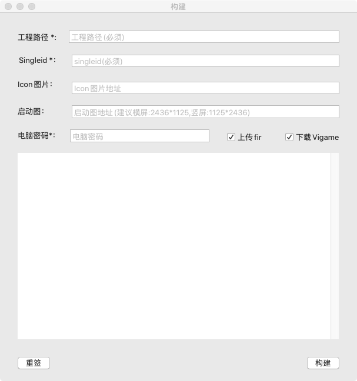

# iOS

## 1. SDK初始化工作 
(注：使用WbUnity插件可忽略)
### 2.1. 导入头文件

在appDelegate文件中引入头文件
`#import "IOSLoader.h"`

### 2.2. 调用初始化入口文件

```objectivec
- (BOOL)application:(UIApplication *)application willFinishLaunchingWithOptions:(NSDictionary *)launchOptions {
    [IOSLoader splashReport];//统计上报
    return YES;
}

- (BOOL)application:(UIApplication *)application didFinishLaunchingWithOptions:(NSDictionary *)launchOptions {
    [IOSLoader application:application DidFinishLaunchingWithOptions:launchOptions];//初始化

    [IOSLoader openSplash]; //闪屏广告
    return YES;
}

- (BOOL)application:(UIApplication *)application continueUserActivity:(NSUserActivity *)userActivity restorationHandler:(void (^)(NSArray<id<UIUserActivityRestoring>> * _Nullable))restorationHandler {

    return [IOSLoader application:application continueUserActivity:userActivity restorationHandler:restorationHandler];
}

- (void)applicationDidEnterBackground:(UIApplication *)application {
    [IOSLoader applicationDidEnterBackground:application];//更新状态
}

- (void)applicationWillEnterForeground:(UIApplication *)application {
   [IOSLoader applicationWillEnterForeground:application];
}

- (void)applicationDidBecomeActive:(UIApplication *)application {
   [IOSLoader applicationDidBecomeActive:application];; //更新状态、开屏广告
}

-(BOOL)application:(UIApplication *)app openURL:(NSURL *)url options:(NSDictionary<UIApplicationOpenURLOptionsKey,id> *)options {
    return [IOSLoader application:app openURL:url options:options];
}
```
## 2. 集成Vigame
使用KTMRobot.dmg，添加相应的参数即可完成SDK对接，并且会生成一个测试包上传到fir.im，提供生成的二维码给到我们测试即可。


按照截图中需求，填入所需选项点击构建即可（Vigame选项第一次必选，后续不更新SDK可以勾掉）
## 交互流程

1. 使用Mac构建工具自动构建测试包--然后测试
2. 测试完成后 换正式包名和证书出正式包上传苹果商店
