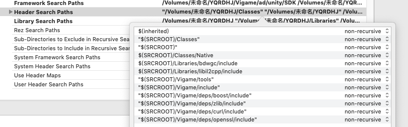

# iOS

## Demo工程克隆地址：

[http://dnsdk.vimedia.cn:8080/r/VigameDemo-iOS.git](http://dnsdk.vimedia.cn:8080/r/VigameDemo-iOS.git)

## 1. 将相关的文件添加到工程中


### \(备注: 将deps文件删除引用。\)

## 2. 添加所有的 .framework .a 文件 路径和头文件链接

\(target-&gt;build setting -&gt; search path -&gt;Header Search Paths 中添加\) 特殊添加一项目录 路径

`"$(SRCROOT)/Vigame/include"`

`"$(SRCROOT)/Vigame/tools"`

`"$(SRCROOT)/Vigame/deps/boost/include"`

`"$(SRCROOT)/Vigame/deps/curl/include"`

`"$(SRCROOT)/Vigame/deps/openssl/include"`

`"$(SRCROOT)/Vigame/deps/zlib/include"`



## 3. 添加必要配置

1. 打开 Capabilities-&gt; Keychain Sharing 获取设备唯一标识
2. 在info.plist添加Google广告配置

   GADIsAdManagerApp：YES

3. 如果项目中使用到Applovin广告在info.plist添加

   AppLovinSdkKey：Occxxxxxxxxxxxxxxxxxxxxxxxxxxxxx

4. 在VigameLibrary.plist 中检测 company\_appid 、apple\_appid、company\_prijid.

   以及相关的统计参数

5. 如果出海外包带有Facebook广告 需要在info.plist文件中添加Facebook 中相关的配置如下：

   

6. 苹果新出的规定无论有没有使用到相机相册都得申请 权限
7. 游戏需要访问网络 需要有网络权限
8. 游戏第三方可能会用到定位，所有游戏info.plist添加NSLocationWhenInUseUsageDescription

## 4.添加系统支持库文件

target-&gt;build phases -&gt; Link Binary With Libraries

`OpenGLES.framework`

`OpenAL.framework`

`iAd.framework`

`WebKit.framework`

`AVFoundation.framework`

`Accelerate.framework`

`MobileCoreServices.framework`

`CoreMotion.framework`

`CoreLocation.framework`

`CoreTelephony.framework`

`QuartzCore.framework`

`StoreKit.framework`

`AdSupport.framework`

`UIKit.framework`

`CoreFoundation.framework`

`CoreGraphics.framework`

`CoreMedia.framework`

`CoreText.framework`

`Security.framework`

`MediaPlayer.framework`

`CFNetwork.framework`

`libresolv.9.tbd`

`SystemConfiguration.framework`

`MessageUI.framework`

`JavaScriptCore.framework`

`AudioToolBox.framework`

`GLKit.framework`

`libz.tbd`

`libsqlite3.tbd`

`libiconv.tbd`

`libxml2.tbd`

`libc++.tbd`

`libz.1.1.3.tbd`

`libresolv.tbd`

`libsqlite3.0.tbd`

`//接入tapjoy需要下面库并且需要添加测试设备`

`PassKit.framework`

`MapKit.framework`

`ImageIO.framework`

`CoreData.framework`

## 5. 设备编译选项

1. `Other Linker Flags添加-ObjC`


1. Enable Bitcode 设置为NO
2. 

## 7. 设置项目为自动内存管理

 

## 8. 接入微信配置（不接入忽略）

在info.plist文件添加


添加微信登陆URL Type


## 9. SDK初始化工作

**1. 导入头文件**

在appDelegate文件中引入头文件`#import "IOSLoader.h"`

**2. 调用初始化入口文件**

```objectivec
- (BOOL)application:(UIApplication *)application willFinishLaunchingWithOptions:(NSDictionary *)launchOptions {
    [IOSLoader splashReport];//统计上报
    return YES;
}

- (BOOL)application:(UIApplication *)application didFinishLaunchingWithOptions:(NSDictionary *)launchOptions {
    [IOSLoader application:application DidFinishLaunchingWithOptions:launchOptions];//初始化

    [IOSLoader openSplash]; //闪屏广告
    return YES;
}

- (BOOL)application:(UIApplication *)application continueUserActivity:(NSUserActivity *)userActivity restorationHandler:(void (^)(NSArray<id<UIUserActivityRestoring>> * _Nullable))restorationHandler {

    return [IOSLoader application:application continueUserActivity:userActivity restorationHandler:restorationHandler];
}

- (void)applicationDidEnterBackground:(UIApplication *)application {
    [IOSLoader applicationDidEnterBackground:application];//更新状态
}

- (void)applicationWillEnterForeground:(UIApplication *)application {
   [IOSLoader applicationWillEnterForeground:application];
}

- (void)applicationDidBecomeActive:(UIApplication *)application {
   [IOSLoader applicationDidBecomeActive:application];; //更新状态、开屏广告
}

-(BOOL)application:(UIApplication *)app openURL:(NSURL *)url options:(NSDictionary<UIApplicationOpenURLOptionsKey,id> *)options {
    return [IOSLoader application:app openURL:url options:options];
}
```

## 交互流程

1. 我们提供一个测试包名和证书（已上线的项目\#为了能出广告\#）
2. 使用测试包名和证书出一个测试包--然后测试
3. 测试完成后 换正式包名和证书出正式包上传苹果商店

