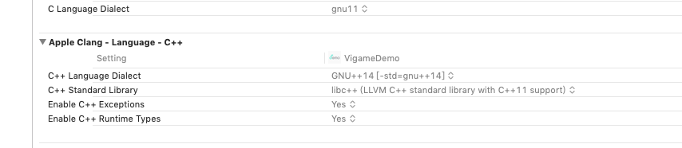

# 常见问题

### 1.接入类

#### 1.1 我的游戏应该接入哪些功能？

解答：

接入文档中所有标记“必接”的接口都需要接入。其他接口是否接入由项目运营人员视情况而定。

#### 1.2 sdk接入成功后需要提供什么？

解答：

SDK接入成功后，先提供测试apk给我们验收，验收通过后提供完整的Android工程文件。

### 2.广告类

#### 2.1 如何测试广告？

解答：

使用demo中的包名和产品参数，并在build.gradle中引入广告补丁，即可进行测试。注意：更换包名或产品参数，将可能导致广告加载失败。

#### 2.2 为什么我的广告位名称无法展现广告？

解答：

因为每个项目所用到的广告位名称有所区别。为了保证测试有效性，建议前期测试时使用Demo中的广告位名称，以下常用广告位名称可直接出广告：

| 名称 | 广告类型 |
| :--- | :--- |
| banner | 横幅 |
| home | 插屏 |
| pause | 插屏 |
| exit\_game | 插屏 |
| level\_restart | 插屏 |
| level\_fail | 插屏 |
| level\_win | 插屏 |
| game\_win | 插屏 |
| game\_fail | 插屏 |
| game\_pause | 插屏 |
| level\_fail\_mfzs | 视频 |
| rotary\_mfzs | 视频 |
| home\_mfzs | 视频 |
| gift\_mfzs | 视频 |
| double\_fail\_mfzs | 视频 |
| dj\_mfzs | 视频 |
| double\_mfzs | 视频 |
| item\_mfzs | 视频 |
| sign\_game | 视频 |

其他广告位名称，可能无法出广告。只需保证正确调用即可。

#### 2.3 开屏\(splash\)和唤醒\(game\_awaken\)广告，如何埋点？

解答：

这两个广告位名称无需做埋点，按照SDK接入流程正常接入即可自动触发。

#### 2.4 原生广告是什么？如何埋点？

解答：

原生广告是指能与游戏自身UI融为一体，不打断游戏操作的广告。可以理解为能自定义大小和位置的横幅广告。

埋点与普通广告类似，只是需要特别传入尺寸和位置参数。例如：

```text
 [IOSLoader openYSBanner:@"yuans" rect:CGRectMake(x, y, width, height)];
```

## 3.常见错误

#### 3.1 在info.plist添加Google广告配置 GADIsAdManagerApp：YES不配置会出现崩溃


#### 解决方式：


#### 3.2 Google广告由于用xib自动布局，需要最低iOS9版本会报如下错误 

#### 解决方式：

#### 3.3缺少include文件配置报错


#### 解决方式：


#### 3.4 缺少include中boost文件引入错误


#### 解决方式：


#### 3.5 weak typeof\(self\)wSelf = self报错：

* A parameter list without types is only allowed in a function definition. A corresponding warning tells me that\*\* weak only applies to Objective-C object or block pointer types;type here is 'int'

#### 解决方式：

Xcode－&gt; Build Settings-&gt; C Language Dialect修改配置，C99改为GNU99，C99不包含typeof

#### 3.6.确认c++ 编译项


#### 解决方式：



