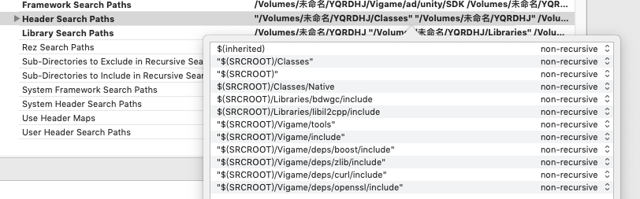
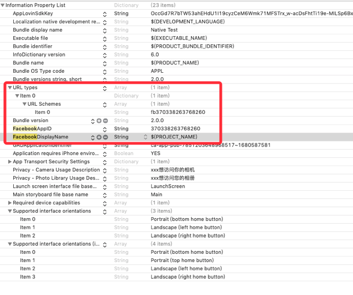
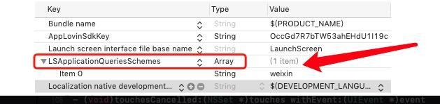
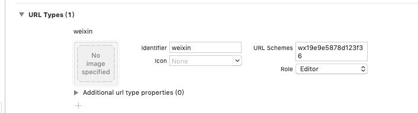

# CocoaPods集成

## 1. CocoaPods添加KTMSDK

自动部署可以省去您工程配置的时间。iOS SDK会通过CocoaPods进行发布，推荐您使用自动部署。

1. 安装CocoaPods

   CocoaPods是一个Swift和Objective-C项目的依赖管理器。它拥有超过49,000个第三方库，超过3,000,000个app都在使用cocoaPods做依赖管理，CocoaPods可以帮助你优雅的扩展你的项目。 如果您未安装过cocoaPods，可以通过以下命令行进行安装。更多详情请访问[CocoaPods官网](https://cocoapods.org/)。

   ```text
   $ sudo gem install cocoapods
   ```

   注意：安装过程可能会耗时比较长，也有可能收到网络状况导致失败，请多次尝试直到安装成功。

2. 配置Podfile文件

   在您的工程文件所在文件夹下有一个名为Podfile的文件。如果您第一次使用CocoaPods，可以在通过以下命令初始化一个Podfile文件：

   ```text
   $ pod init
   ```

   打开Podfile文件，应该是如下内容（具体内容可能会有一些出入）： 更具需求单pod需要接入的功能

   ```text
   source 'http://wy@dnsdk.vimedia.cn:8080/r/IOSMavenSpec.git' #远程私有库地址
   source 'https://cdn.cocoapods.org/' #公有库地址

   platform :ios, '9.0'
   target 'Unity-iPhone' do

   sdkVersion='1.0.0'

   ####--广告---###
   pod 'KTMSDK/Ads/ByteDance',sdkVersion
   pod 'Bytedance-UnionAD', '2.8.0.1'
   pod 'KTMSDK/Ads/IronSource',sdkVersion
   pod 'KTMSDK/Ads/Admob',sdkVersion
   pod 'KTMSDK/Ads/GDT',sdkVersion
   pod 'KTMSDK/Ads/Unity',sdkVersion
   pod 'KTMSDK/Ads/Mintegral',sdkVersion
   pod 'KTMSDK/Ads/Facebook',sdkVersion
   pod 'KTMSDK/Ads/Applovin',sdkVersion
   pod 'KTMSDK/Ads/KTMAd',sdkVersion
   pod 'KTMSDK/Ads/Vungle',sdkVersion

   ####--统计---###
   pod 'KTMSDK/Analysis/Umeng',sdkVersion
   pod 'KTMSDK/Analysis/TrackingIO',sdkVersion
   pod 'KTMSDK/Analysis/ByteDance',sdkVersion
   pod 'KTMSDK/Analysis/DataEye',sdkVersion
   pod 'KTMSDK/Analysis/Appsflyer',sdkVersion
   pod 'KTMSDK/Analysis/Facebook',sdkVersion
   pod 'KTMSDK/Analysis/Adjust',sdkVersion
   pod 'KTMSDK/Analysis/Tenjin',sdkVersion
   pod 'KTMSDK/Analysis/Google',sdkVersion

   ####--社交（登录）---###
   pod 'KTMSDK/Social/wechat',sdkVersion
   pod 'KTMSDK/Social/facebook',sdkVersion
   pod 'KTMSDK/Social/apple',sdkVersion

   ####--扩展---###
   pod 'KTMSDK/Extension/notice',sdkVersion
   pod 'KTMSDK/Extension/activity',sdkVersion
   pod 'KTMSDK/Extension/auth',sdkVersion

   ####--内购---###
   pod 'KTMSDK/IAP',sdkVersion 

   ####--Bugly---###
   pod 'KTMSDK/Bugly',sdkVersion

   end
   ```

   注：ironsource聚合广告需单独导入

   ```text
   #IronSource 聚合广告按需添加
   pod 'IronSourceAdMobAdapter','4.3.10.1'
   pod 'IronSourceFacebookAdapter','4.3.14.0'
   pod 'IronSourceUnityAdsAdapter','4.3.0.1'
   pod 'IronSourceTikTokAdapter','4.1.2.7'
   pod 'IronSourceAppLovinAdapter','4.3.10.1'
   pod 'IronSourceMintegralAdapter','4.3.1.0'
   ```

## 2.添加Vigame模块

1、自动添加

```text
  cd /Users/xx/xx
  git clone https://github.com/hohua88/Vigame.git
  git clone https://github.com/hohua88/deps.git
```

配置可以执行Vigame模块中的auto.sh脚本，具体参见 [脚本构建](https://github.com/jieban0604/VigameDoc/tree/ae57de14708d5444e6f1ef3b4a82ef875535b3a9/cn/ke-hu-duan-jie-ru/ios-jie-ru/脚本构建.md) 2、手动添加 链接:[https://github.com/hohua88/vigame](https://github.com/hohua88/vigame)

### 2.1. 添加所有的 .a 文件 路径和头文件链接

\(备注: 将deps文件删除引用。\)

\(target-&gt;build setting -&gt; search path -&gt;Header Search Paths 中添加\) 特殊添加一项目录 路径

`"$(SRCROOT)/Vigame/include"`

`"$(SRCROOT)/Vigame/deps/boost/include"`

`"$(SRCROOT)/Vigame/deps/curl/include"`

`"$(SRCROOT)/Vigame/deps/openssl/include"`

`"$(SRCROOT)/Vigame/deps/zlib/include"`



### 2.2. 添加必要配置

1. 打开 Capabilities-&gt; Keychain Sharing 获取设备唯一标识
2. 在info.plist添加Google广告配置

   GADIsAdManagerApp：YES

3. 如果出海外包带有Facebook广告 需要在info.plist文件中添加Facebook 中相关的配置如下：

   

4. 苹果新出的规定无论有没有使用到相机相册都得申请 权限
5. 游戏需要访问网络 需要有网络权限
6. 游戏第三方可能会用到定位，所有游戏info.plist添加NSLocationWhenInUseUsageDescription

### 2.3. 接入微信配置（不接入忽略）

在info.plist文件添加



添加微信登陆URL Type



## 6. SDK初始化工作

注：使用WbUnity插件可忽略此步 **1. 导入头文件**

在appDelegate文件中引入头文件`#import "IOSLoader.h"`

**2. 调用初始化入口文件**

```objectivec
- (BOOL)application:(UIApplication *)application willFinishLaunchingWithOptions:(NSDictionary *)launchOptions {
    [IOSLoader splashReport];//统计上报
    return YES;
}

- (BOOL)application:(UIApplication *)application didFinishLaunchingWithOptions:(NSDictionary *)launchOptions {
    [IOSLoader application:application DidFinishLaunchingWithOptions:launchOptions];//初始化

    [IOSLoader openSplash]; //闪屏广告
    return YES;
}

- (BOOL)application:(UIApplication *)application continueUserActivity:(NSUserActivity *)userActivity restorationHandler:(void (^)(NSArray<id<UIUserActivityRestoring>> * _Nullable))restorationHandler {

    return [IOSLoader application:application continueUserActivity:userActivity restorationHandler:restorationHandler];
}

- (void)applicationDidEnterBackground:(UIApplication *)application {
    [IOSLoader applicationDidEnterBackground:application];//更新状态
}

- (void)applicationWillEnterForeground:(UIApplication *)application {
   [IOSLoader applicationWillEnterForeground:application];
}

- (void)applicationDidBecomeActive:(UIApplication *)application {
   [IOSLoader applicationDidBecomeActive:application];; //更新状态、开屏广告
}

-(BOOL)application:(UIApplication *)app openURL:(NSURL *)url options:(NSDictionary<UIApplicationOpenURLOptionsKey,id> *)options {
    return [IOSLoader application:app openURL:url options:options];
}
```

## 交互流程

1. 我们提供一个测试包名和证书（已上线的项目\#为了能出广告\#）
2. 使用测试包名和证书出一个测试包--然后测试
3. 测试完成后 换正式包名和证书出正式包上传苹果商店

