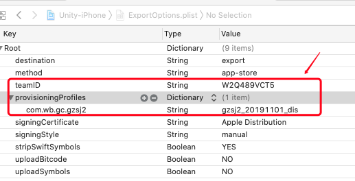

# 脚本接入

#### 1.cd当前工程目录
```
cd /User/XXXX
```

#### 2.下载Vigame到工程
#### 2.1 执行clone命令下载
```
git clone https://github.com/hohua88/Vigame.git
```
#### 2.2 手动下载
[地址](https://github.com/hohua88/Vigame)
#### 3.修改ExportOptions.plist

#### 4.执行auto.sh脚本
```
./Vigame/auto.sh 2e5ddfd7b7bae7d #执行脚本 参数为singleid是必须
```
脚本执行完成后，打的包在工程目录下的ipa文件内

