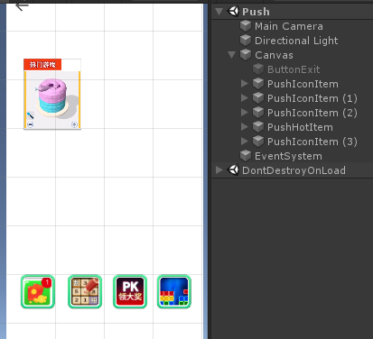
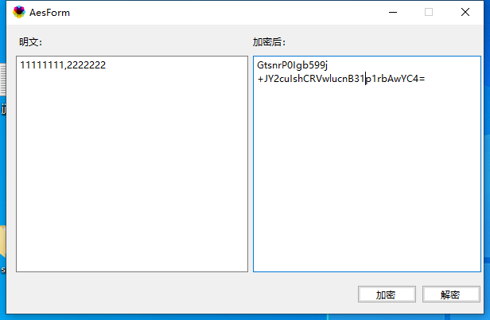

# Unity

## Demo工程克隆地址 ：

### Unity工程：

```cpp
git clone http://dnsdk.vimedia.cn:8080/r/UnityDemo.git
```

### Android Studio 工程：

```cpp
git clone http://dnsdk.vimedia.cn:8080/r/UnityDemo-Android.git
```

### Android 多渠道模板工程：（仅供内部使用）

```cpp
git clone http://192.168.1.252:8080/r/android/UnityDemo-Android-Ex.git
```

### Xcode 工程：

```cpp
git clone http://dnsdk.vimedia.cn:8080/r/UnityDemo-IOS.git
```

## 导入Unity插件

插件下载地址：[UniWb.Wb](http://gui.vigame.cn/UniWb/wb/UniWb.Wb.unitypackage)

将UniWb.Wb.unitypackage导入成功后，在资源管理界面中会出现名为**Streanming**与**Wb**两个文件夹。

**StreamingAssets/st.txt** 保存的是签名的信息。

**Wb** 文件夹存放业务接口，主要有 ADManger , CoreManger, PayManger, ToolManger, XyxManger等。

## 接口使用

参考业务接口进行接入：

### [业务接口](ye-wu-jie-kou/)

## 互推使用

导入 UniWb.Wb.unitypackage 后， 在 Wb/Xyx/prefab/ 文件夹下可以找到不同的互推样式。

视频类型的请使用**PushHotItem**，如图示中大的互推。

icon类型的互推使用 **PushIconItem** 预制体，如图示中底部的四个。

将预制体拖入 canvas 即可。

在打包安卓时 需使用 112234 项目id 测试。

**隐藏 互推要使用 PushItem 中的 SetVisible 接口 （重要） 不能自己隐藏**

若在有的手机上无法正常显示，查看 Project Serrings-> Other Settings-> Auto Graphics API 是否勾选 （需要勾选）



## 签名验证

在游戏开始的时候，如果需要签名验证，调用该方法

```text
 Wb.CoreManager.Instance.CheckSignature();
```

StreamingAssets/st.txt 文件保存默认签名 加密后的哈希值，内容为：kDiJOe7UjhVAbaGa7qTIIuFZo1fVMThwKsLeFVlk0AY=

如需添加自己的签名，可下载地址 [vigame签名获取工](http://gui.vigame.cn/signtool/vigame签名获取工具.apk)[具](http://gui.vigame.cn/signtool/vigame签名获取工具.apk)。

[加密工具下载](http://gui.vigame.cn/WbAESGUI/WbAESGUI.exe)

然后用待添加的签名，签名上述apk，用加密工具加密签名的哈希值， 然后在 st.txt 文件里添加上述工具中获取到的签名信息 （注意明文签名用英文逗号分割）。



## Android 接入

#### 1.添加Android相关模块

参考以下链接进行接入：

### [Android](android-jie-ru/)

> 请跳过链接页面中第五步的第2条，因为后面已使用Activity继承代替。

#### 2.在 build.gradle 中加入Unity桥接模块

```java
implementation WB.fixVersions('Bridge:UnityBridge')
```

#### 3.将主Acitivy继承UniWbActivity或者将UniWbActivity作为主Activity。

```java
package org.vigame.demo;
import android.os.Bundle;
import com.vigame.unitybridge.UniWbActivity;

public class AppActivity extends UniWbActivity 
{    
   @Override  
   protected void onCreate(Bundle savedInstanceState) 
   {       
        super.onCreate(savedInstanceState);  
   }
}
```

> UniWbActivity已经继承UnityPlayerActivity

## iOS 接入

#### 1.添加iOS相关模块

参考以下链接进行接入：

### [iOS](ios-jie-ru/)

#### 2.修改iOS 桥接文件

在 项目 Bridge 文件下 修改 AdBridge.h 和 AdBridge.mm 文件， 直接全部覆盖

```c
extern "C"
{
    // ADManager
    void OpenAd(const char* adName);
    void OpenYsAd(const char* adName,int width,int height, int x,int y);
    void CloseAd(const char* videoName);
    bool IsAdReady(const char* adName);
    bool IsAdBeOpenInLevel(const char* adName, int level);

    // CoreManager
    void UseCDKey(const char* dhm);
    void OpenActivityPage();
    void OpenActivityNotice();
    void OpenRank();
    void OpenUserAgreement();
    void OpenFeedback();
    void SetGameName(const char* adName);
    const char* GetChannel();
    const char* GetPrjid();
    const char* GetAppid();
    const char* GetLsn();
    const char* GetUuid();
    const char* GetImsi();
    const char* GetImei();

    // PayManager
    void OrderPay(int payId);
    void OrderPay2(int payId, const char* userData);
    void OrderPay3(int payId, int price, const char* userData);
    int GetGiftCtrlFlagUse(int giftId);
    bool IsSupportExit();
    void OpenExitGame();
    bool IsMoreGameBtn();
    void OpenMoreGame();
    bool IsPayReady();
    char* GetDefaultFeeInfo();

    // TjManager
    void TJCustomEvent(const char* eventId);
    void TJCustomEvent2(const char* eventId,const char* label);
    void TJCustomEvent3(const char* eventId,const char* map);
    void StartLevel(const char* level);
    void FinishLevel(const char* level, const char* score);
    void FailLevel(const char* level, const char* score);

    // ToolManger
    void ShockPhone();
    void ApplicationExit();
    void SetKeyEnable();
    void ShowToast(const char* str);

    // XyxManger
    void OnIconClicked(int id);
    const char* GetIconURL(int id);
    const char* GetGameList();
    int GetIconCount();

}
```

```cpp
#import "AdBridge.h"

#import "IOSLoader.h"
//
#include "vigame_core.h"
////广告
#include "vigame_ad.h"
////统计
#import "vigame_tj.h"
////支付
#import "vigame_pay.h"
#include "pay/FeeInfo.h"

//字符串分割函数
vector<string> split(string str, string pattern)
{
    string::size_type pos;
    vector<string> result;

    str += pattern;//扩展字符串以方便操作
    int size = str.size();

    for (int i = 0; i<size; i++) {
        pos = str.find(pattern, i);
        if (pos<size) {
            std::string s = str.substr(i, pos - i);
            result.push_back(s);
            i = pos + pattern.size() - 1;
        }
    }
    return result;
}

extern "C"
{
    /////////////////////////////////////////// ADManager
    static bool isFistOpenAD = true;

    void OpenAd(const char* adName)
    {
        string str = adName;
        vigame::ad::ADManager::openAd(adName,[=](vigame::ad::ADSourceItem* adSourceItem, int result){
            char param[64] = {0};
            /*打开视频成功*/
            if (result==0) sprintf(param, "%s#true",str.c_str());
            /*打开视频失败*/
            else sprintf(param, "%s#false",str.c_str());
            printf("%s\n",param);
            UnitySendMessage("ADManager", "VideoCallBack" ,param);
        });

        // 如果是第一次打开，改变状态？
        if(isFistOpenAD)
        {
            isFistOpenAD = false;
            vigame::ad::ADManager::setAdStatusChangedCallback([=](vigame::ad::ADSourceItem* adSourceItem){
                std::string type = adSourceItem->adSourcePlacement->type;
                int stute = adSourceItem->getStatus();
                if (stute == 9 && type == "plaque") {
                    UnitySendMessage("ADManager", "VideoCallBack" ,"false");
                }
            });
        }
    }

    void OpenYsAd(const char* adName,int width,int height, int x,int y)
    {
        NSLog(@"width = %d height = %d x=%d y= %d",width,height,x,y);
        CGFloat kScreenScale = (NSInteger)[UIScreen mainScreen].scale;
        CGSize size = [UIScreen mainScreen].bounds.size;
        if ((NSInteger)size.height==736) {
            kScreenScale/=1.15;
        }
        // 打开广告同时设置size
        vigame::ad::ADManager::openAd(adName, width/kScreenScale, height/kScreenScale, x/kScreenScale, y/kScreenScale);
    }

    void CloseAd(const char* adName)
    {
        vigame::ad::ADManager::closeAd(adName);
    }

    bool IsAdReady(const char* adName)
    {
        bool result = vigame::ad::ADManager::isAdReady(adName);
        return result;
    }

    bool IsAdBeOpenInLevel(const char* adName, int level)
    {
        return vigame::ad::ADManager::isAdBeOpenInLevel(adName, level);
    }

    /////////////////////////////////////////// CoreManager
    void UseCDKey(const char* dhm) { vigame::dhm::use(dhm);}
    void OpenActivityPage() { vigame::activity::open();}
    void OpenActivityNotice() { vigame::notice::open();}
    void OpenRank() { vigame::rank::open();}
    void OpenUserAgreement() { vigame::UserAgreement::open();}
    void OpenFeedback(){ vigame::feedback::open();}
    void SetGameName(const char* adName){ vigame::CoreManager::setGameName(adName);}
    const char* GetChannel() { return vigame::SysConfig::getInstance()->getChannel().c_str();}
    const char* GetPrjid(){ return vigame::SysConfig::getInstance()->getPrjid().c_str();}
    const char* GetAppid(){ return vigame::SysConfig::getInstance()->getAppid().c_str();}
    const char* GetLsn(){ return vigame::SysConfig::getInstance()->getLsn().c_str();}
    const char* GetUuid(){ return vigame::SysConfig::getInstance()->getUUID().c_str();}
    const char* GetImsi(){ return vigame::SysConfig::getInstance()->getImsi().c_str();}
    const char* GetImei(){ return vigame::SysConfig::getInstance()->getImei().c_str();}

    /////////////////////////////////////////// PayManager
    void OrderPay(int payId) { vigame::pay::PayManager::orderPay(payId);}
    void OrderPay2(int payId, const char* userData) { vigame::pay::PayManager::orderPay(payId,userData);}
    void OrderPay3(int payId, int price, const char* userData) { vigame::pay::PayManager::orderPay(payId,price,userData);}
    int GetGiftCtrlFlagUse(int giftId) { return vigame::pay::PayManager::getGiftCtrlFlag(giftId);}
    bool IsSupportExit(){ return vigame::pay::PayManager::isExitGame();}
    void OpenExitGame() { vigame::pay::PayManager::openExitGame();}
    bool IsMoreGameBtn() { return vigame::pay::PayManager::isMoreGame();}
    void OpenMoreGame() { vigame::pay::PayManager::openMoreGame();}
    bool IsPayReady()
    {
        return true;

    }
    char* GetDefaultFeeInfo()
    {
//        vigame::pay::FeeInfo* fee = vigame::pay::PayManager::getDefaultFeeInfo();
//        if(fee == nullptr) return  nullptr;
//        return fee.
        return nullptr;
    }

    /////////////////////////////////////////// TjManager
    void TJCustomEvent(const char* eventId) { vigame::tj::DataTJManager::event(eventId);}
    void TJCustomEvent2(const char* eventId,const char* label) { vigame::tj::DataTJManager::event(eventId,label);}
    void TJCustomEvent3(const char* eventId,const char* map)
    {
        std::unordered_map<std::string,std::string > umap;

        vector<string> spv =  split(map,"#");
        for (int i =0; i< spv.size(); i++) {
            if(spv[i].length() <=0) continue;
            vector<string> kv = split(spv[i],",");
            umap.insert(std::pair<std::string,std::string>(kv[0],kv[1]));
        }
        vigame::tj::DataTJManager::event(eventId,umap);
    }
    void StartLevel(const char* level) { vigame::tj::DataTJManager::startLevel(level);}
    void FinishLevel(const char* level, const char* score) { vigame::tj::DataTJManager::finishLevel(level,score);}
    void FailLevel(const char* level, const char* score) { vigame::tj::DataTJManager::failLevel(level,score);}

    /////////////////////////////////////////// ToolManger
    void ShockPhone() {}
    void ApplicationExit() {}
    void SetKeyEnable() {}
    void ShowToast(const char* str) {}

    /////////////////////////////////////////// XyxManger
    void OnIconClicked(int id)
    {
//        vigame::XYXItemList* list = vigame::XYXManager::getInstance()->getConfig()->getXYXItemList();
//        if(list == nullptr || list->size() <=0) return;
//        list->at(id);
//        vigame::XYXManager::getInstance()->getConfig()->ha
    }
    const char* GetIconURL(int id) { return nullptr;}
    const char* GetGameList() { return nullptr;}
    int GetIconCount(){ return -1;}

}
```

