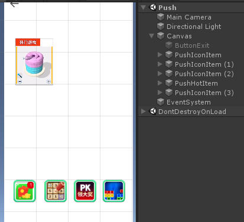

# 互推使用

导入 UniWb.Wb.unitypackage 后， 在 Wb/Xyx/prefab/ 文件夹下可以找到不同的互推样式。

视频类型的请使用**PushHotItem**，如图示中大的互推。

icon类型的互推使用 **PushIconItem** 预制体，如图示中底部的四个。

将预制体拖入 canvas 即可。

在打包安卓时 需使用 112234 项目id 测试。

**隐藏 互推要使用 PushItem 中的 SetVisible 接口 （重要） 不能自己隐藏**

若在有的手机上无法正常显示，查看 Project Serrings-&gt; Other Settings-&gt; Auto Graphics API 是否勾选 （需要勾选）

## 

