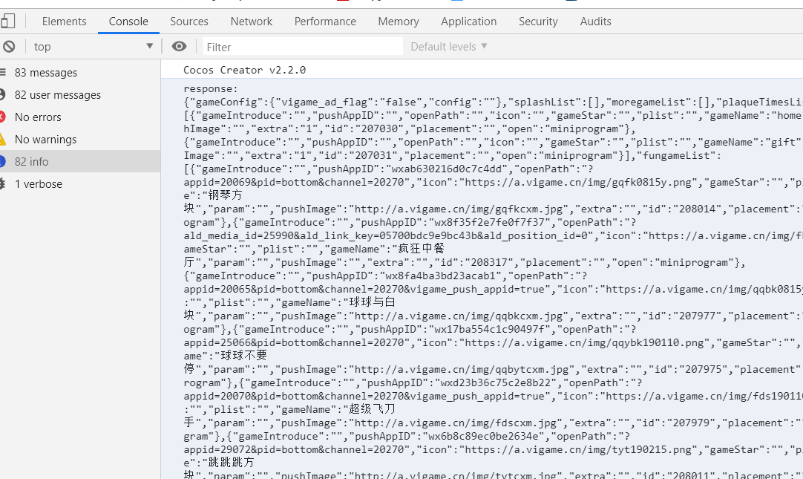

# 小游戏接入

## 一、接入流程

### 1.申请参数

联系动能商务人员获取产品参数。包括：

* 小游戏等平台的Appid，比如微信、手Q等
* 动能的Appid
* 如果发布微信还需要阿拉丁的app\_key

需确保在微信后台配置以下request域名地址：

* [https://log.aldwx.com](https://log.aldwx.com)
* [https://api.vzhifu.net](https://api.vzhifu.net)
* [https://tj.vzhifu.net](https://tj.vzhifu.net)
* [https://a.vigame.cn](https://a.vigame.cn)

### 2.导入SDK

1\)下载SDK压缩包，解压至本地目录。

[SDK下载](sdk-xia-zai.md)

CreatorDemo克隆地址（Creator2.2.2制作）:

[http://dnsdk.vimedia.cn:8080/r/CreatorDemo-H5.git](http://dnsdk.vimedia.cn:8080/r/CreatorDemo-H5.git)

LayaDemo克隆地址（Laya1.0制作）:

[http://dnsdk.vimedia.cn:8080/r/WechatDemo-Laya.git](http://dnsdk.vimedia.cn:8080/r/WechatDemo-Laya.git)

2\)将"dnsdk.js"文件引入到项目中。

注：建议导入到公用头部，确保项目环境能访问到dnsdk工具类。

3\)如发布微信，需接入阿拉丁SDK。

> 参考： [http://doc.aldwx.com/aldwx/src/game.html](http://doc.aldwx.com/aldwx/src/game.html) 的“一、接入SDK”部分。
>
> 注：只需要引入sdk部分，不需要调用接口。

### 3.接入SDK方法

详见“二、接入方法说明”

### 4.测试

查看输出，有服务器数据输出即表示接入成功。

### 

### 

### 

