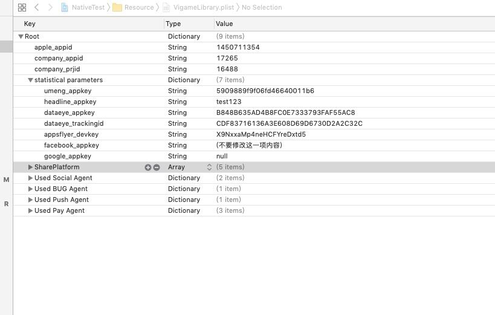

# Vigame接入说明手册
## 1. 将相关的文件添加到工程中


#### (备注: 将deps文件删除引用。)

## 2. 添加所有的 .framework .a 文件 路径和头文件链接

(target->build setting -> search path ->Header Search Paths 中添加)
特殊添加一项目录 路径

`"$(SRCROOT)/Vigame/include"`

`"$(SRCROOT)/Vigame/tools"`

`"$(SRCROOT)/Vigame/deps/boost/include"`

`"$(SRCROOT)/Vigame/deps/curl/include"`

`"$(SRCROOT)/Vigame/deps/openssl/include"`

`"$(SRCROOT)/Vigame/deps/zlib/include"`


## 3. 添加必要配置

1. 打开 Capabilities-> Keychain Sharing 获取设备唯一标识
2. 在info.plist添加Google广告配置
    GADIsAdManagerApp：YES
3. 如果项目中使用到Applovin广告在info.plist添加
    AppLovinSdkKey：Occxxxxxxxxxxxxxxxxxxxxxxxxxxxxx
4. 在VigameLibrary.plist 中检测 company_appid 、apple_appid、company_prijid.
    以及相关的统计参数
5. 如果出海外包带有Facebook广告 需要在info.plist文件中添加Facebook 中相关的配置如下：

    

6. 苹果新出的规定无论有没有使用到相机相册都得申请 权限
7. 游戏需要访问网络 需要有网络权限
8. 游戏第三方可能会用到定位，所有游戏info.plist添加NSLocationWhenInUseUsageDescription

## 4.添加系统支持库文件

target->build phases -> Link Binary With Libraries

`OpenGLES.framework`

`OpenAL.framework`

`iAd.framework`

`WebKit.framework`

`AVFoundation.framework`

`Accelerate.framework`

`MobileCoreServices.framework`

`CoreMotion.framework`

`CoreLocation.framework`

`CoreTelephony.framework`

`QuartzCore.framework`

`StoreKit.framework`

`AdSupport.framework`

`UIKit.framework`

`CoreFoundation.framework`

`CoreGraphics.framework`

`CoreMedia.framework`

`CoreBluetooth.framework`

`CoreText.framework`

`Security.framework`

`MediaPlayer.framework`

`CFNetwork.framework`

`libresolv.9.tbd`

`SystemConfiguration.framework`

`MessageUI.framework`

`JavaScriptCore.framework`

`AudioToolBox.framework`

`GLKit.framework`

`libz.tbd`

`libsqlite3.tbd`

`libiconv.tbd`

`libxml2.tbd`

`libc++.tbd`

`libz.1.1.3.tbd`

`libresolv.tbd`

`libsqlite3.0.tbd`

`//接入tapjoy需要下面库并且需要添加测试设备`

`PassKit.framework`

`MapKit.framework`

`ImageIO.framework`

`CoreData.framework`

## 5. 设备编译选项

1. `Other Linker Flags添加-ObjC`


2. Enable Bitcode 设置为NO


## 6 常见配置错误及解决方法
1. 在info.plist添加Google广告配置
    GADIsAdManagerApp：YES
不配置会出现崩溃


添加方式如下：


2. Google广告由于用xib自动布局，需要最低iOS9版本会报如下错误


3. 如果报这个错误，修改游戏支持iOS版本最低为iOS9，参考下图


4. 缺少include文件配置报错


解决如下：


5. 缺少include中boost文件引入错误


解决如下：


6. __weak typeof(self)wSelf = self报错：- A parameter list without types is only allowed in a function definition. A corresponding warning tells me that __weak only applies to Objective-C object or block pointer types;type here is 'int'

解决方案: Xcode－> Build Settings-> C Language Dialect修改配置，C99改为GNU99，C99不包含typeof

## 7. 确认c++ 编译项


报错


## 8设置项目为自动内存管理


# 9接入微信配置（不接入忽略）
在info.plist文件添加


添加微信登陆URL Type


## 10 SDK初始化工作

##### 1 导入头文件

在appDelegate文件中引入头文件`#import "IOSLoader.h"`

##### 2 调用初始化入口文件

```
- (BOOL)application:(UIApplication *)application willFinishLaunchingWithOptions:(NSDictionary *)launchOptions {
    [IOSLoader splashReport];//统计上报
    return YES;
}

- (BOOL)application:(UIApplication *)application didFinishLaunchingWithOptions:(NSDictionary *)launchOptions {
    [IOSLoader progressWKContentViewCrash];//处理GDT开屏广告点击崩溃
    [IOSLoader startLoaderLibrary];//初始化
    return YES;
}

- (BOOL)application:(UIApplication *)application continueUserActivity:(NSUserActivity *)userActivity restorationHandler:(void (^)(NSArray<id<UIUserActivityRestoring>> * _Nullable))restorationHandler {

    if (userActivity.activityType == NSUserActivityTypeBrowsingWeb) {
    [IOSLoader application:application continueUserActivity:userActivity];//appflyer统计相关设置
    return YES;
    }
    return NO;
}

- (void)applicationDidEnterBackground:(UIApplication *)application {
    [IOSLoader is_Active:false];//更新状态
}

- (void)applicationWillEnterForeground:(UIApplication *)application {
   [IOSLoader isAwaken];
}

- (void)applicationDidBecomeActive:(UIApplication *)application {
    [IOSLoader is_Active:true]; //更新状态、开屏广告
     [IOSLoader openAwakenAd];
}

-(BOOL)application:(UIApplication *)app openURL:(NSURL *)url options:(NSDictionary<UIApplicationOpenURLOptionsKey,id> *)options {
    [IOSLoader isOpenURL];//解决唤醒广告在微信登录、充值频繁问题
    return YES;
}

```

## 11 代码调用
```
#import "IOSLoader.h"

```

###### 1.通过广告位名称打开一个广告

```
 // 打开一个横幅广告
  [IOSLoader openBanner];
```

```
 // 关闭横幅广告
  [IOSLoader closeBanner];

```

```
// 打开一个原生横幅广告
[IOSLoader openYSBanner:@"yuans" rect:CGRectMake(100, 20, 300, 190)];

```

```
// 关闭原生横幅广告
[IOSLoader closeYSBanner:@"yuans"];

```
```
  // 打开一个插屏广告
  [IOSLoader openAd:@"game_fail" callback:^(BOOL flag) {
      if (flag == false) {
      //恢复游戏音效
      }
  }];

//建议更换下面接口
[IOSLoader openAd:@"game_fail" adCallback:^(BOOL flag, KTMADType type) {
    if (type == KTMADTypePlaque && flag == false) {
    //恢复游戏音效
    }
}];
```

```
 /*检查某个视频广告位是否加载成功*/
 //
 [IOSLoader isAdReady:@"rotary_mfzs"];
```

```
// 打开一个视频广告 && 监听是否视频播放成功

[IOSLoader openAd:@"rotary_mfzs" callback:^(BOOL flag) {
    //处理加载框
    if (flag) {
    NSLog(@"open succed");
    }
    else {
    NSLog(@"open failure");
    }
}];

//建议更换下面接口
[IOSLoader openAd:@"rotary_mfzs" adCallback:^(BOOL flag, KTMADType type) {
//处理加载框
    if (type == KTMADTypeVideo) {
        
        if (flag) {
        NSLog(@"open succed");
        }
        else {
        NSLog(@"open failure");
        }
    }
}];

```


###### 2.添加自定义统计事件

```
//统计

```
```
//统计付费
[IOSLoader tj_payWithMoney:6.00 productId:@"xxx.xxx.xxx" number:60 price:60];
```
```
+ (void)setFirstLaunchEventID0:(const char*)eventId0 eventID1:(const char*)eventId1 eventID2:(const char*)eventId2 eventID3:(const char*)eventId3;

+ (void)tj_name:(NSString *)name;
+  (void)tj_name:(NSString *)name value:(NSString *)value;
+ (void)tj_name:(const char  *)name map:(const char *)json;

+ (void)isAdBeOpenInLevel:(NSString *)adPostionName level:(int)level;

//关卡统计相关接口
+ (void)tj_startLevel:(NSString *)level;
+ (void)tj_finishLevel:(NSString *)level;
+ (void)tj_failLevel:(NSString *)level;

//充值统计
+ (void)tj_payWithMoney:(double)money productId:(NSString *)productId number:(int)number price:(double)price;
```

```
// 导入支付头文件 发起支付
//充值接口
[IOSLoader textPayWithProductId:2003 callBack:^(NSDictionary *dic) {
    if ([dic[@"reasonCode"] integerValue] == 0) {
    //购买成功
}
}];

//补发道具
 [IOSLoader payConsumableGoodsRecoveryCallBack:^(NSDictionary * dic) {
            //补发道具
            
            //补发成功调用接口
            [IOSLoader payConsumableGoodsRecoveryFinish];
}];
```
###### 3.是否越狱/审核中
```
#pragma mark - 是否审核中
+ (BOOL)isAudit;
#pragma mark - 是否越狱
+ (BOOL)isRoot;
```
###### 4.微信登陆

```
// 在AppDelegate.m导入头文件
#import "WXSocialAgent.h"

 - (BOOL)application:(UIApplication *)application didFinishLaunchingWithOptions:(NSDictionary *)launchOptions {
  [WXSocialAgent application:application DidFinishLaunchingWithOptions:launchOptions];
    
    return YES;
}

-(BOOL)application:(UIApplication *)app openURL:(NSURL *)url options:(NSDictionary<UIApplicationOpenURLOptionsKey,id> *)options {
     [[[WXSocialAgent alloc] init] application:app handleOpenURL:url];
    return YES;
}

```
```
// 导入头文件
#import "IOSLoader.h"
*注本接口已整合微信登录逻辑（已登录不再跳转到登录，游戏方不需再判断是否登录的情况）
[IOSLoader wxLogin:^(KTMLoginState code, NSString *returnMsg) {
            if (code == KTMLoginStateSuccess) {
                //调用获取用户信息接口
                [IOSLoader getWXUserInfo:^(NSDictionary *userInfo) {
                    NSLog(@"userInfo == %@",userInfo);
                }];
            }
        }];
```
```
userInfo数据格式如下，按需获取头像地址、openid、nickname等信息
{
    city = "";
    country = "";
    headimgurl = "http://thirdwx.qlogo.cn/mmopen/vi_32/DYAIOgq83epXrSKiaXoSxs38WdicmRuwQQjzk5Xnia9N3OAfGCGdIjRCWXic5mbm2vMDPkx96tLKAHVHKjdjcWYDgA/132";
    language = "zh_CN";
    nickname = "\U5149\U5934\U5f3a2\U53f7";
    openid = "oN702waxaalZ-1ycPtpfj0ALpbeg";
    privilege =     (
    );
    province = "";
    sex = 0;
    unionid = ofp95s1JJofVChMLEULM0H40iaEs;
}
```

* * *

## 交互流程

1. 我们提供一个测试包名和证书（已上线的项目#为了能出广告#）
2. 使用测试包名和证书出一个测试包--然后测试
3. 测试完成后 换正式包名和证书出正式包上传苹果商店

```OpenGLES.framework
```

```text
```iAd.framework
```

```text
```AVFoundation.framework
```

```text
```MobileCoreServices.framework
```

```text
```CoreLocation.framework
```

```text
```QuartzCore.framework
```

```text
```AdSupport.framework
```

```text
```CoreFoundation.framework
```

```text
```CoreMedia.framework
```

```text
```CoreText.framework
```

```text
```MediaPlayer.framework
```

```text
```libresolv.9.tbd
```

```text
```MessageUI.framework
```

```text
```AudioToolBox.framework
```

```text
```libz.tbd
```

```text
```libiconv.tbd
```

```text
```libc++.tbd
```

```text
```libresolv.tbd
```

## 5.设备编译选项

```text
target->build setting ->Other Linker Flags      添加```-ObjC
target->build setting ->Enable Bitcode 设置为NO
target->build setting ->C language Dialect 设置为 gnu11
target->build setting ->C++ language Dialect 设置为 GNU++14[-std=gnu++14]
target->build setting ->C++ language Enable C++ Runtime Times 设置为YES
target->build setting ->Objective-C Automatic Reference Counting 设置为YES
```


## 6. SDK初始化工作

在工程的入口appDelegate.m文件中 应用头文件 `#import "IOSLoader.h"`

（unity 项目的项目入口文件 为 UnityAppController.mm

cocos creator 项目的项目入口文件为 AppController.mm ）

调用SDK 初始化方法

```text
- (BOOL)application:(UIApplication *)application didFinishLaunchingWithOptions:(NSDictionary *)launchOptions {

​    [IOSLoader startLoaderLibrary];

​    //your code here
​    
​    //打开开屏广告
​    [IOSLoader openSplash];​ 
​    return YES;   
}
```

```text
- (void)applicationDidEnterBackground:(UIApplication *)application {

    [IOSLoader is_Active:false];
}
```

```text
- (void)applicationDidBecomeActive:(UIApplication *)application {
    [IOSLoader is_Active:true];
}
```

## 7. 调用广告

引用广告头文件`#include "vigame_ad.h"`

```text
 // 打开一个横幅广告
 vigame::ad::ADManager::openAd("banner");
```

```text
// 打开关闭横幅广告
vigame::ad::ADManager::closeAd("banner");
```

```text
// 打开一个插屏广告 参数为广告位名称
vigame::ad::ADManager::openAd("pause");
```

```text
 // 打开一个开屏广告
 vigame::ad::ADManager::openAd("splash");
```

```text
 /*监听 某个视频广告位是否加载成功*/
 //方式1  参数为广告位名称
 vigame::ad::ADManager::addAdReadyChangedCallback("level_fail_mfzs", [=]    (bool isReady){
        if (isReady) {
            NSLog(@"level_fail_mfzs视频广告位 加载成功");
        }
  });
//方式2
vigame::ad::ADManager::isAdReady("level_fail_mfzs");
```

```text
// 打开一个视频广告 && 监听是否视频播放成功  参数为打开广告位名称
  vigame::ad::ADManager::openAd("level_fail_mfzs",[=](vigame::ad::ADSourceItem* adSourceItem, int result){
      if (1 == result) {/*打开视频失败*/ }
      else if( 0 == result){/*打开视频成功*/ }
   });
```

```text
// 在 appDelegate.mm 文件中  打开一个 唤醒游戏广告
- (void)applicationDidBecomeActive:(UIApplication *)application {
    //打开一个唤醒广告
    [IOSLoader openGame_awaken];
}
```

```text
// 在 appDelegate.mm 文件中  打开一个 开屏广告
- (BOOL)application:(UIApplication *)application didFinishLaunchingWithOptions:(NSDictionary *)launchOptions {
    [IOSLoader openSplash];
}
```

## 8.参数填写

`apple_appid` 苹果id 在苹果商店 注册应用产生的参数 `company_appid` 公司appid

`company_prjid` 公司的项目id

`statistical parameters` 中包换各种统计需要的参数 如果需要使用到 对应的统计平台 填写对应的参数 如果不需要使用对应的平台 对应的value选项填null 或者空着



