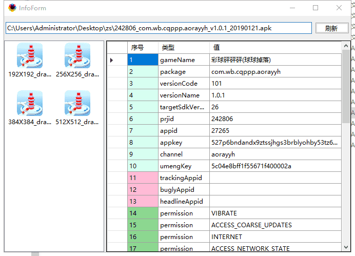

# apk信息工具

​	显示apk 版本号，包名等信息

## 下载地址

[v1.0.4](http://gui.vigame.cn/apkInfo/v1.0.4/apkInfo_1.0.4.zip

**修改** ：

1. 添加 签名 SHA1  SHA256 显示

[v1.0.3](http://gui.vigame.cn/apkInfo/v1.0.3/apkInfo_1.0.3.zip)

**修改** ：

1. 搜索com.gg.wb.game  在AndroidManifest里面确认是否广点通的路径改变  搜索com.bdtt.sdk.wmsdk 确认头条  com.wzhl.sdk确认玩转

[v1.0.2](http://gui.vigame.cn/apkInfo/v1.0.2/apkInfo_1.0.2.zip)

**修改** ：

1. 显示 签名MD5 ，显示 oppo app_key, huawei (appid) , com.gg.wb.game, com.qq.e.ads

   微信 wxapi ， 支付宝 alipay

[v1.0.1](http://gui.vigame.cn/apkInfo/v1.0.1/apkInfo_1.0.1.zip)

## 鼠标右键

​	解压后右键以管理员身份运行，然后右键 apk 出现 showApkInfo 则代表成功

若安装了 apkdb 这个工具，则右键快捷方式则无效果，卸载后即可。

​        若无 showApkInfo 这个选项 ，则 以管理员身份运行  ，添加到鼠标右键2.bat

## 主界面

左侧会显示 apk 所有的 icon 图片，右侧会显示 apk 信息的一些信息，空行则会显示 粉红色。