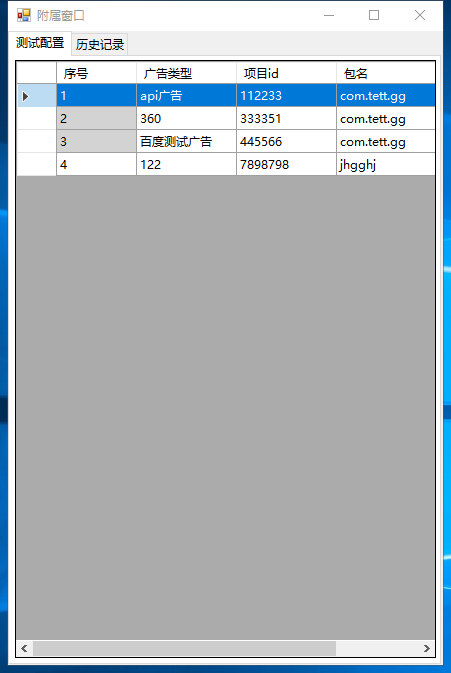

# 出包工具

## 下载

[v1.0.3](http://gui.vigame.cn/createApk/v1.0.3/createApk_1.0.3.zip)

1. 可替换 targetsdk 

2. 修改为重新打开界面后，关闭直前界面

3. 提示apk路径不合法

   

[v1.0.2](http://gui.vigame.cn/createApk/v1.0.2/createApk_1.0.2.zip)

1. 添加记录上次出包配置

2. 修改了数据库地址（重要）

   

[v1.0.1](http://gui.vigame.cn/createApk/v1.0.1/createApk_1.0.1.zip)

1. 更新 鼠标右键bat 脚本，添加了 apk 默认icon 
2. 添加了解析 dex 文件（点击dex 文件即可）
3. 添加 显示自身icon bat 脚本

[v1.0.0](http://gui.vigame.cn/createApk/v1.0.0/createApk_1.0.0.zip)

## 登陆

默认 账号是你的 姓名拼音，默认密码为 123456

## 添加到鼠标右键

 下载完后，解压压缩包，会有 **添加到鼠标右键.bat** 文件，右键以**管理员运行**，则会添加到鼠标右键

比较方便的对 apk 进行操作。 显示如下

 **wbDecompileApk ：** 反编译apk

 **wbCompileApk：**重编译apk, 会在 dist 目录 生成已签好名的包

 **wbSignApk：**签名apk

 **wbInstallApk：**安装apk

 **wbReBuildApk：**打开出包工具

## 出包界面

**apk路径框：** 选择要操作的 apk 拖入即可获取路径

**出包框：** 要出的包显示在这，若单元格中没有数据，则不会替换原包的数据，默认项目id 必须添加。

可选要出的配置行右键出包，则不会全部出。点击开始出包则会全部出。

 右键同时支持反编译，重编译，签名，安装等操作。

**线程数：** 为了加快批量包的出包速度，添加了线程数，根据自己电脑的性能选择恰当的线程数将会加快出包速度

**显示框：** 显示出包过程中的信息

## 附属窗口

**测试配置**：

 测试配置数据由配置工具测试配置而来，可以右键选中添加到出包窗口，灰色底的序号 为不可修改选项

其余的为自己本地的测试id,可修改和删除。

**历史记录：**

 每次开始出包后将会记录出包的配置，将会保存在本地数据库，但是不会保存icon 图片，图片保存在 cache 文件夹下。右键可以添加出包记录在出包窗口中，继续出包。

