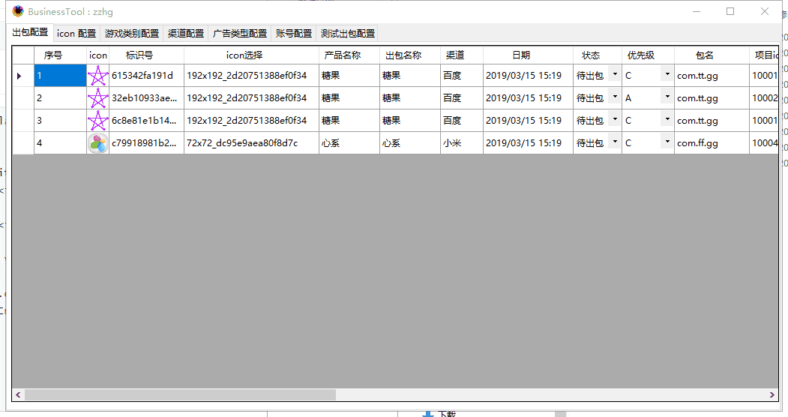
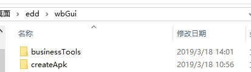
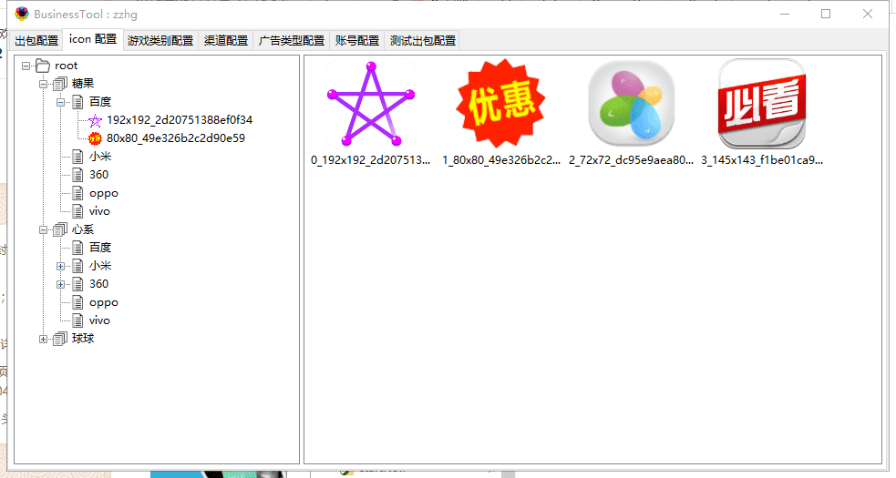
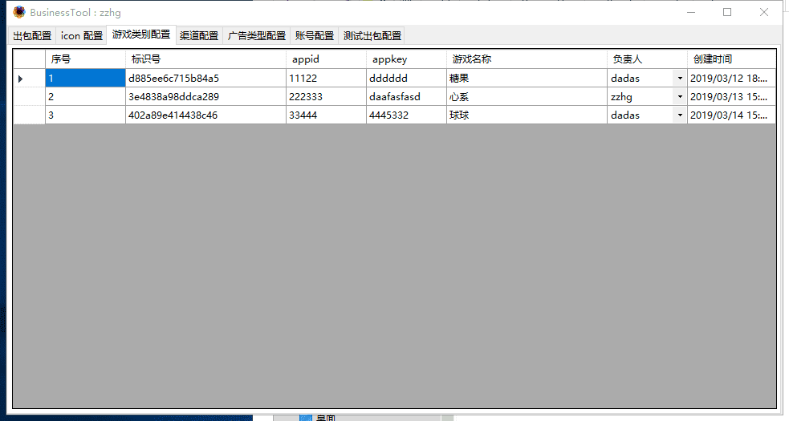
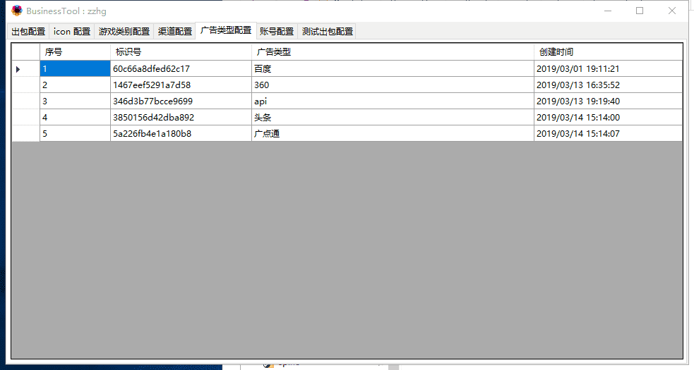
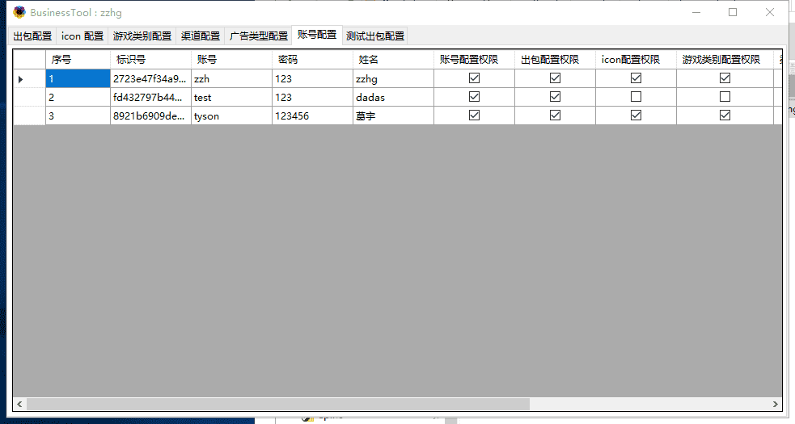
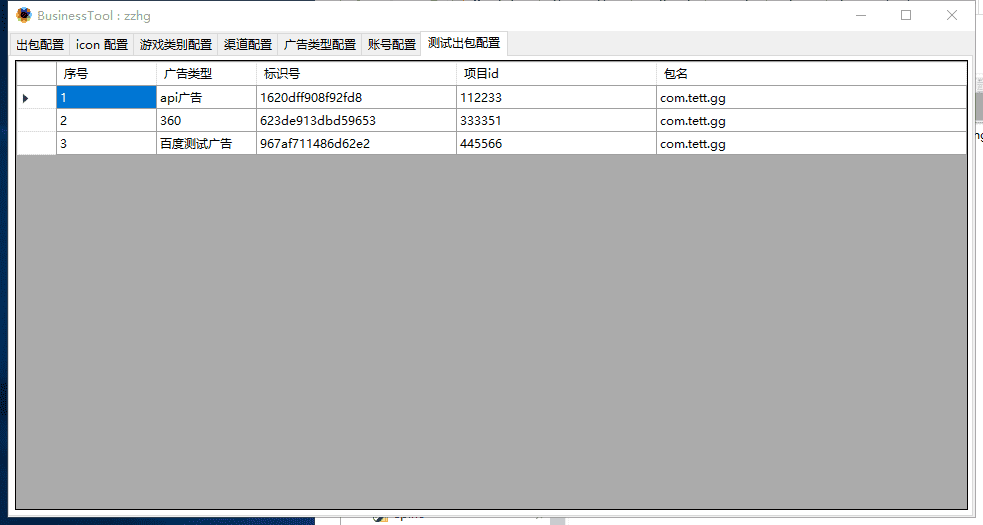

# 配置工具

 配置工具主要用来配置远程数据库的数据，客户端可以共享数据

## 下载

[v1.0.3](http://gui.vigame.cn/businessTools/v1.0.3/businessTools_1.0.3.zip)

## 登陆

### 账号：

 登陆账号由管理员分配，账号名 一般为姓名的拼音，初始密码为 123456（可修改）。

### 作用：

 登陆主要的作用是限制不同的账号，有不同的配置权限，避免数据管理混乱，同时也可以

记录人员的姓名和操作记录的目的。

## 出包配置

**icon :** 只能在 icon 配置里配置，出包配置页面里不可选

**标识号 :** 每一个出包需求都有唯一的标识号

**icon选择 :** 选择后，将会刷新对应的数据，icon 产品名称 ，出包名称，渠道。 如果有之前保存过的信息，同时会自动把 其它参数补全， 例如包名，版本号，dataEye, 友盟id。

**特殊说明 ：**需求需要说明一些特殊要求是可写在这里，可以换行写多行。

**sdk参数 :** 一些渠道的参数可以写在这里，

**出包：** 右键出包，将会显示出包工具，参数数据将会显示在出包工具里，同时你需要将出包工具与配置工具放在同一根目录

## icon 配置

**刷新 ：**选择某个节点，可以进行刷新操作

**添加 ：**选择渠道，例如百度，鼠标右键就可以添加 新的 icon 图片，图片名称为 图片大小加唯一标识号

**删除：**鼠标右键即可选择删除 icon

**导出：**选择右侧的icon \(可多选\) 右键即可以导出 icon 图片

## 游戏类别配置

右键可选择 添加，保存，删除，刷新的操作

## 广告配置

广告的类型可以在这里添加

右键可选择 添加，保存，删除，刷新的操作

## 账号配置

账号由超级管理员分配，同时可以管理账号的权限

## 测试出包配置

测试用的测试 id 和包名可以配置在这里，在出包工具里将会显示

