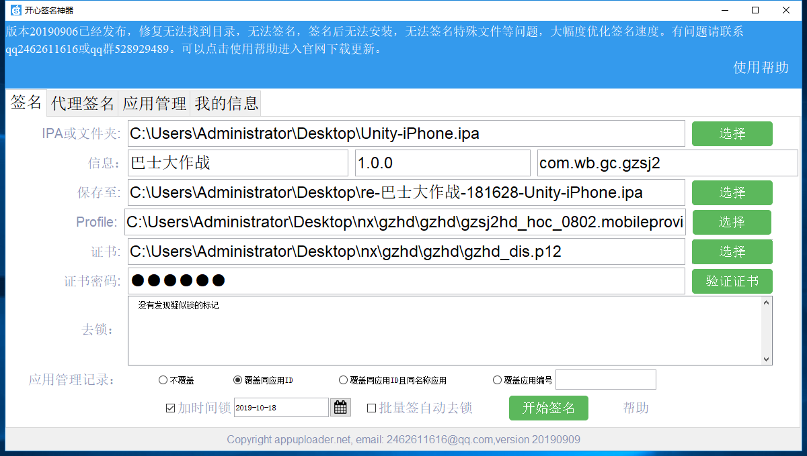

# ipa签名

windows 下重签名 ios ipa 文件

## 下载

[changeSystem](http://gui.vigame.cn/ipaSign/changeSystem.exe)

[ios\_sign\_win](http://gui.vigame.cn/ipaSign/ios_sign_win.zip)

[plisteditor\_setup](http://gui.vigame.cn/ipaSign/plisteditor_setup.exe)

## 开始

​ 下载 ios\_sign\_win 后解压 ，运行 ausign\_gui.exe，先会要求登陆邮箱注册， 这个地方可以随便乱填，密码也可乱填，进入后选择 ipa 文件 , 证书文件 和密码 就可以 点击开始签名即可。

因为是普通用户，所以每个月只有 10 次签名次数，此时需要用到 changeSystem.exe 工具，直接下载下来运行

先点 RandAll 按钮， 然后点击 ok 按钮即可， 然后 进入 签名工具-&gt; 我的信息 退出当前账号，重进签名工具，重新乱填一个账号，就会又有 10 次。

## 修改 pjid 等信息

​ 下载 plisteditor\_setup 后安装，就可以查看和修改 ios 二进制文件了。当签名工具 选择了 ipa 文件后，签名工具文件夹下的该目录，可以修 plist 文件，然后再点 开始签名 按钮即可。

...\ios\_sign\_win\ausign\_runtime\temp\c29fbc8e-58c8-4ea2-9129-03b0e3698af8\Payload\ProductName.app\VigameLibrary.plist

