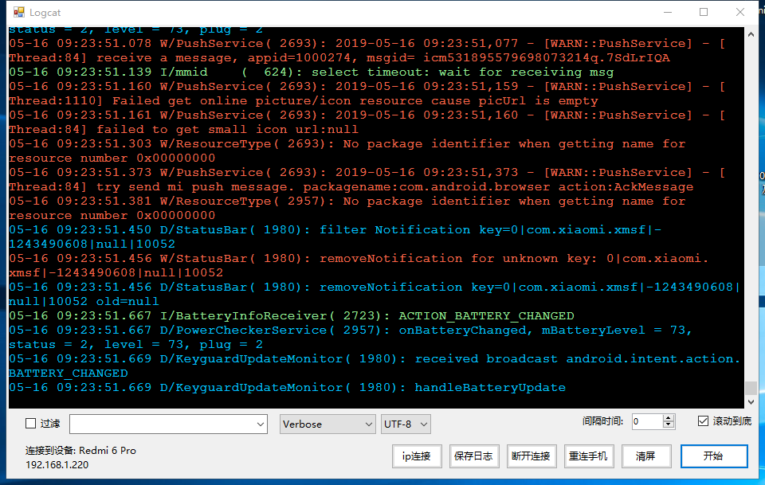

# logcat工具

​	显示 安卓 log 信息

## 下载地址

[v1.0.1](http://gui.vigame.cn/logcat/v1.0.0/logcat_1.0.0.zip)

  添加 ios log日志，优化软件性能。

[v1.0.0](http://gui.vigame.cn/logcat/v1.0.0/logcat_1.0.0.zip)

## 主界面

进入界面后，如果adb 已运行则会默认连接手机， 若没有连接到手机，则重连手机

ip 连接： 输入手机连接到wifi 的 ip 地址，必须与电脑是同一局域网