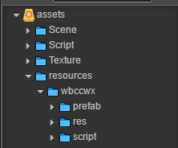
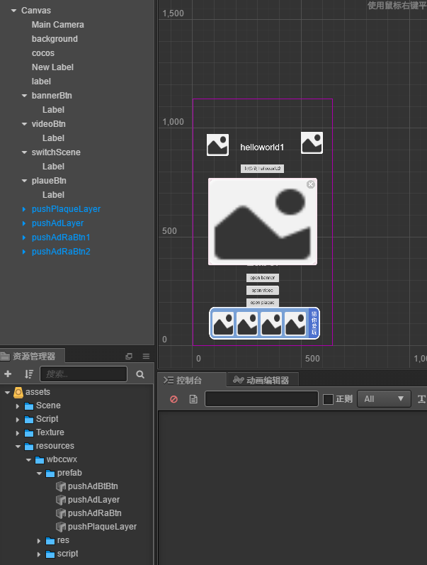
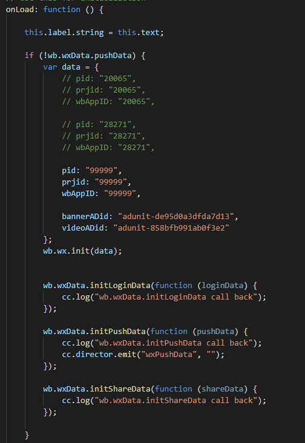

# cocoscreator 微信小游戏

## git地址

## [http://192.168.1.252:8080/r/wbjs.git](http://192.168.1.252:8080/r/wbjs.git)

## 示例项目

wbjs\creatortest\cccTest 目录下是 示例，可以用cocoscreator 打开查看

## wbjs 接入

将wbccwx 拖入到 项目的 resources 目录



## 使用

选择要使用的prefab 拖入到界面



## 初始化

在游戏开始初始进入的地方 进行数据的初始化



### 注意 ： pid,prjid,wbAppId 填一样即可， 99999 是测试id, 正式上线项目需改

## 必要接口（重要）

```javascript
wb.wx.loginPost（）  // 在游戏资源加载完后调用，方便商务统计

wb.resetVigameAdFlag（） // 在进入游戏界面后调用，（第一次进入游戏主界面时，有时为了应对审核，需要
// 关闭互推，进入游戏时需调用此方法，第二次进入游戏后就可正常显示）
```

## 常用接口

```javascript
 wb.ADManager.openAd("banner");   // 打开banner
 wb.ADManager.closeAd("banner");  // 关闭banner


  // 打开视频
 wb.ADManager.openAdC("video", function (a, result) {
            if (result == 0) {
                // "播放成功~";
            } else {
                //  "视频未播放完~";
            }
        }.bind(this));

 // 打开插屏，需要先把插屏 prefab 拖到界面上，不需要则可不用
 wb.createPushPlaque();
```

